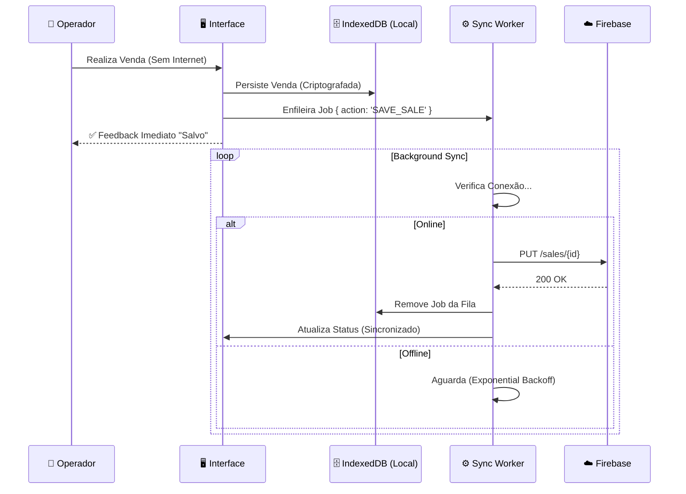

# 🍺 Botequista Pro - Sistema de Gestão para Bares (PWA)

<div align="center">


**[📘 Documentação Técnica Completa](DOCUMENTATION.md)**

> *Este repositório representa uma Prova de Conceito funcional, desenvolvida com foco em arquitetura offline-first e performance.*

</div>

---

## ⚡ Visão Geral

O **Botequista Pro** é uma solução **PWA (Progressive Web App)** de nível enterprise para gestão de bares e restaurantes. Projetado sob a filosofia **Offline-First**, ele garante que a operação de vendas (PDV) continue fluida e sem interrupções, independentemente da estabilidade da conexão de internet.

Diferente de sistemas web tradicionais, o Botequista trata a nuvem como um "estado eventual", priorizando a responsividade local e a segurança dos dados na ponta (Edge).

---

## 🏛️ Arquitetura Offline & Sync

O coração do sistema é uma **SyncQueue** (Fila de Sincronização) resiliente. O diagrama abaixo ilustra como garantimos que nenhuma venda seja perdida:



### Stack Tecnológica

| Camada | Tecnologia | Destaques |
| :--- | :--- | :--- |
| **Frontend** | React 19 | Hooks modernos, `useDeferredValue` para performance. |
| **Linguagem** | TypeScript | Tipagem estrita e interfaces compartilhadas. |
| **Persistência** | IndexedDB (`idb`) | Banco transacional no navegador. |
| **Backend** | Firebase RTDB | NoSQL em tempo real com regras de validação. |
| **API** | Vercel Serverless | Functions para buscas pesadas e relatórios. |
| **Design** | Tailwind CSS | Sistema de design tokenizado e Dark Mode nativo. |

---

## 🧠 Decisões de Engenharia

### Por que Firebase RTDB e não Firestore?
Optamos pelo **Realtime Database** pela sua estrutura JSON nativa, que mapeia diretamente para objetos JavaScript e facilita o espelhamento "raw" no IndexedDB. O overhead de latência do Firestore e o modelo de cobrança por leitura não se adequavam à nossa estratégia de sincronização frequente de pequenos pacotes de estado (SyncQueue).

### Por que PWA e não App Nativo?
O **Botequista** precisa rodar em hardware heterogêneo (tablets baratos Android, iPads antigos, PCs Windows). O PWA oferece:
1.  **Deploy Instantâneo:** Atualizações críticas chegam a todos os terminais em segundos via Vercel.
2.  **Custo Zero de Distribuição:** Sem taxas de Apple/Google Store ou tempo de aprovação.
3.  **Capacidades Nativas:** Service Workers modernos já permitem cache robusto e acesso a hardware suficiente para PDV.

### Trade-offs do Offline-First
A arquitetura "Local-First" traz desafios específicos que foram aceitos em prol da disponibilidade:
*   **Consistência Eventual:** A UI é otimista; o usuário vê a ação concluída antes do servidor confirmar.
*   **Gestão de Conflitos:** Utilizamos a estratégia *Last-Write-Wins* baseada em timestamp do cliente, assumindo que a operação mais recente no ponto físico de venda é a autoridade máxima.

### Limitações Conhecidas
*   **Safari/iOS:** O ciclo de vida do Service Worker no iOS é agressivo. Se o app não for adicionado à Home Screen ("Add to Home Screen"), o Safari pode limpar o IndexedDB após 7 dias de inatividade.
*   **Concorrência:** Não há bloqueio de registro (Locking) em tempo real entre dispositivos.

---

## 📸 Interface do Sistema

> *O design prioriza contraste, legibilidade em ambientes noturnos e áreas de toque grandes para telas touch.*

| **Terminal de Vendas (PDV)** | **Relatórios Gerenciais** |
| :---: | :---: |
|  |  |
| *Fluxo rápido com botões de acesso imediato* | *Curva ABC e Fluxo de Caixa em tempo real* |

---

## 🚀 Funcionalidades Chave

### 1. Venda Expressa (Speed-Checkout)
Para bares com alto giro de balcão. O sistema gera automaticamente uma comanda temporária, bloqueia métodos de pagamento demorados (como "Pendura") e foca em fechar o pedido em menos de 3 cliques.

### 2. Tesouraria "Blind Close"
O fechamento de caixa é "cego". O operador insere a contagem física do dinheiro sem saber o valor esperado pelo sistema. O Botequista calcula automaticamente sobras ou quebras, prevenindo furtos e erros de contagem.

### 3. Gestão de Inventário & Curva ABC
Engenharia de cardápio integrada. Identifique automaticamente quais produtos são seus "Carro-Chefe" (Alta Venda / Alta Margem) e quais são "Abacaxis" (Baixa Venda / Baixa Margem).

### 4. Inteligência e Segurança Operacional (v4.7.3)
- **Engenharia de Cardápio:** Controle de custo (CMV) e cálculo de lucro real por item.
- **Taxa de Serviço:** Módulo de gratificação inteligente com relatório de pool para equipe.
- **Cardápio Digital QR:** Menu minimalista sincronizado com estoque.
- **Admin Lock & Logout Guard:** Proteção da conta mestre e prevenção de saídas acidentais.
- **WhatsApp Summary:** Envio instantâneo de faturamento e métricas ao dono.
- **UX Polish:** Legibilidade aumentada, tooltips contextuais e tabs responsivas.
Validações avançadas no cadastro (preço zero, duplicidade), notificações visuais dinâmicas (Toasts persistentes e coloridos) e interface PDV totalmente responsiva para qualquer hardware.

---

## 🔧 Instalação e Desenvolvimento

```bash
# 1. Clone o repositório
git clone https://github.com/seu-usuario/botequista.git

# 2. Instale as dependências
npm install

# 3. Configure o ambiente
# Crie um arquivo .env na raiz com as chaves do Firebase
cp .env.example .env

# 4. Inicie o servidor local
npm run dev
```

## 📜 Licença

© 2024 Botequista Systems. Todos os direitos reservados.
Distribuído sob licença proprietária para uso comercial restrito.

---
*Designed with Offline-First Architecture, Performance and Business-Critical Reliability in mind. *
