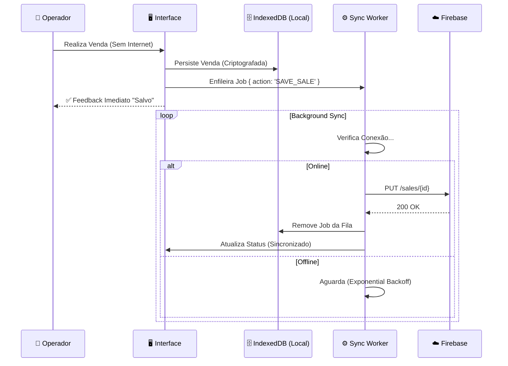

# 🍺 Botequista Pro - Sistema de Gestão para Bares (PWA)

<div align="center">


**[📘 Documentação Técnica Completa](DOCUMENTATION.md)**

> *Este repositório representa uma Prova de Conceito funcional, desenvolvida com foco em arquitetura offline-first e performance.*

</div>

---

## ⚡ Visão Geral

O **Botequista Pro** é uma solução **PWA (Progressive Web App)** de nível enterprise para gestão de bares e restaurantes. Projetado sob a filosofia **Offline-First**, ele garante que a operação de vendas (PDV) continue fluida e sem interrupções, independentemente da estabilidade da conexão de internet.

Diferente de sistemas web tradicionais, o Botequista trata a nuvem como um "estado eventual", priorizando a responsividade local e a segurança dos dados na ponta (Edge).

---

## 🏛️ Arquitetura Offline & Sync

O coração do sistema é uma **SyncQueue** (Fila de Sincronização) resiliente. O diagrama abaixo ilustra como garantimos que nenhuma venda seja perdida:



### Stack Tecnológica

| Camada | Tecnologia | Destaques |
| :--- | :--- | :--- |
| **Frontend** | React 19 | Hooks modernos, `useDeferredValue` para performance. |
| **Linguagem** | TypeScript | Tipagem estrita e interfaces compartilhadas. |
| **Persistência** | IndexedDB (`idb`) | Banco transacional no navegador. |
| **Backend** | Firebase RTDB | NoSQL em tempo real com regras de validação. |
| **API** | Vercel Serverless | Functions para buscas pesadas e relatórios. |
| **Design** | Tailwind CSS | Sistema de design tokenizado e Dark Mode nativo. |

---

## 🧠 Decisões de Engenharia

### Por que Firebase RTDB e não Firestore?
Optamos pelo **Realtime Database** pela sua estrutura JSON nativa, que mapeia diretamente para objetos JavaScript e facilita o espelhamento "raw" no IndexedDB. O overhead de latência do Firestore e o modelo de cobrança por leitura não se adequavam à nossa estratégia de sincronização frequente de pequenos pacotes de estado (SyncQueue).

### Por que PWA e não App Nativo?
O **Botequista** precisa rodar em hardware heterogêneo (tablets baratos Android, iPads antigos, PCs Windows). O PWA oferece:
1.  **Deploy Instantâneo:** Atualizações críticas chegam a todos os terminais em segundos via Vercel.
2.  **Custo Zero de Distribuição:** Sem taxas de Apple/Google Store ou tempo de aprovação.
3.  **Capacidades Nativas:** Service Workers modernos já permitem cache robusto e acesso a hardware suficiente para PDV.

### Trade-offs do Offline-First
A arquitetura "Local-First" traz desafios específicos que foram aceitos em prol da disponibilidade:
*   **Consistência Eventual:** A UI é otimista; o usuário vê a ação concluída antes do servidor confirmar.
*   **Gestão de Conflitos:** Utilizamos a estratégia *Last-Write-Wins* baseada em timestamp do cliente, assumindo que a operação mais recente no ponto físico de venda é a autoridade máxima.

### Limitações Conhecidas
*   **Safari/iOS:** O ciclo de vida do Service Worker no iOS é agressivo. Se o app não for adicionado à Home Screen ("Add to Home Screen"), o Safari pode limpar o IndexedDB após 7 dias de inatividade.
*   **Concorrência:** Não há bloqueio de registro (Locking) em tempo real entre dispositivos.

---

## 📸 Interface do Sistema

> *O design prioriza contraste, legibilidade em ambientes noturnos e áreas de toque grandes para telas touch.*

| **Terminal de Vendas (PDV)** | **Relatórios Gerenciais** |
| :---: | :---: |
|  |  |
| *Fluxo rápido com botões de acesso imediato* | *Curva ABC e Fluxo de Caixa em tempo real* |

---

## 🚀 Funcionalidades Chave

### 1. Venda Expressa (Speed-Checkout)
Para bares com alto giro de balcão. O sistema gera automaticamente uma comanda temporária, bloqueia métodos de pagamento demorados (como "Pendura") e foca em fechar o pedido em menos de 3 cliques.

### 2. Tesouraria "Blind Close"
O fechamento de caixa é "cego". O operador insere a contagem física do dinheiro sem saber o valor esperado pelo sistema. O Botequista calcula automaticamente sobras ou quebras, preventindo furtos e erros de contagem.

### 3. Gestão de Inventário & Curva ABC
Engenharia de cardápio integrada. Identifique automaticamente quais produtos são seus "Carro-Chefe" (Alta Venda / Alta Margem) e quais são "Abacaxis" (Baixa Venda / Baixa Margem).

### 4. Inteligência e Segurança Operacional (v4.9.0)
- **Radar de Prejuízo (v4.9.0):** Algoritmo que cruza CMV e vendas para apontar itens com margens abaixo de 30% e alto giro, ajudando o dono a agir contra a inflação e precificar melhor.
- **Smart Stock Híbrido (v4.9.0):** Alertas de estoque preditivos para itens controlados e modo **Alta Demanda (Hot Item)** para produtos sem estoque.
- **Modo Evento / Balada (v4.8.1):** Trava o PDV em fluxo de Venda Expressa contínua.
- **Happy Hour Inteligente (v4.8.1):** Transição de preços automática com badges promocionais.
- **QR Code da Mesa (v4.7.3):** Cliente escaneia para ver a conta ou pagar.
- **Resumo Diário via WhatsApp:** Relatório consolidado enviado automaticamente ao fechar o turno.

### 5. Monitor de Produção da Cozinha (v4.9.5)
Painel dark-mode touch-friendly de alto contraste desenvolvido especialmente para cozinhas, bares ou chapas.
- **Fila de Produção Reativa (PENDING):** Agrupa os pratos a serem feitos com base nos pedidos das comandas ativas (FIFO), com cronômetros de tempo de espera e alertas de atraso cromáticos.
- **Campainha e Alertas Globais (Ding! 🛎️):** Sintetizador Web Audio API puro que gera som físico de campainha de balcão e dispara alertas Toast sincronizados para todos os atendentes conectados ao mesmo bar no exato milissegundo em que o prato é marcado como pronto.
- **Sinalização Reativa no PDV (🛎️):** O PDV avisa o garçom piscando um sino nos cards de mesa que possuem pratos prontos, enquanto a Sidebar exibe o total de pendências em tempo real.
- **Histórico e Segurança Financeira (Fechada 🔒):** Mantém comandas fechadas/pagas visíveis na aba de "Prontos" por 2h (limite de 15 tickets). Estes tickets aparecem com uma trava de segurança e cadeado, impedindo edições manuais que possam afetar os relatórios financeiros do caixa.

### 6. Registro de Perda & Desperdício de Estoque (v5.0.0)
Módulo inteligente para rastrear descarte de insumos e mercadorias com total transparência e auditoria.
- **Lógica de Custo Histórico:** Grava o preço de custo no momento exato do descarte (`LOSS`), protegendo relatórios financeiros contra flutuações futuras de preços de compra.
- **Isolamento de Segurança:** Unidades que operam sem controle de estoque (`useStock: false`) são blindadas contra alterações acidentais, ocultando painéis e abas de relatórios de forma 100% dinâmica.
- **Logs de Auditoria Imutáveis:** Rastreabilidade total contendo operador responsável, data/hora, produto, quantidade e categoria do descarte (Quebra, Vencimento, Consumo Equipe ou Erro de Preparo).
- **Dashboard Premium:** Análise detalhada com KPIs de impacto financeiro, volume de descarte, impacto no CMV e ranking de perdas por categoria.

### 7. Pacote de Eficiência e Lançamento (v5.1.0)
Focado no dia a dia da equipe, usabilidade rápida em trânsito e controle ativo de penduras.
- **Régua de Cobrança 1-Clique (WhatsApp):** No relatório de devedores, um botão "Cobrar" permite disparar mensagens amigáveis pré-formatadas diretamente via WhatsApp Web sem precisar digitar.
- **Detector de Garçom Esperto (Ticket Médio):** Nova coluna e alternância de ordenação por Ticket Médio de vendas no relatório de equipe, destacando com o selo dourado o atendente mais eficiente em upsell.
- **Badge Mobile de Unidade Ativa:** Badge vermelho piscante no cabeçalho visível em celulares, garantindo que o garçom no salão veja instantaneamente qual terminal está ativo e evite lançar vendas duplicadas no terminal incorreto.

### 8. Previsão de Demanda & Hardening de Permissionamentos (v5.2.0)
Foco em inteligência preditiva local e segurança operacional avançada sem quebra de retrocompatibilidade.
- **Previsão de Movimento (Demand Forecast):** Motor matemático offline que cruza médias históricas do dia da semana e geolocalização do clima local (API Open-Meteo) com um simulador de clima manual e checklist dinâmico de preparo.
- **Matriz de Direitos Híbrida & Retrocompatível:** Implementação de permissões granulares de acesso (estoque, Modo Evento, lembretes de WhatsApp, CMV/margens) acopladas a uma camada de heranças dinâmicas que impede lockouts de usuários legados.

### 9. Assistente do Dono (Premium) (v5.3.0)
Módulo offline de inteligência de negócios e controladoria financeira para o proprietário:
- **Resumo de Saúde Financeira:** Faturamento consumido (líquido de 10% de serviço), CMV consolidado, lucro bruto real e margens de lucro consolidadas de vendas.
- **Matriz BCG de Engenharia de Cardápio:** Classificação dinâmica em quadrantes (Estrelas, Vacas Leiteiras, Quebra-Cabeças, Abacaxis) cruzando mediana de giro e média de margem de lucro. Inclui atualização simplificada de custos pendentes em lote.
- **Precificador de Margem Alvo:** Simulador interativo local para sugerir preços de venda com base no custo de mercadoria para margens de 50%, 60% e 70%.
- **Ranking de Upsell de Atendentes:** Tabela de performance de vendas que classifica a equipe pela proporção de itens de alta margem vendidos, com distintivos automáticos.
- **Alertas de Ruptura e Auditoria:** Avisos preditivos de ruptura de estoque (dias restantes) e alertas de segurança contra anomalias (mesas ociosas sem novos pedidos há mais de 4h, diferenças de caixa > 5% e cancelamentos excessivos de operadores).

---

## 🔧 Instalação e Desenvolvimento

```bash
# 1. Clone o repositório
git clone https://github.com/seu-usuario/botequista.git

# 2. Instale as dependências
npm install

# 3. Configure o ambiente
# Crie um arquivo .env na raiz com as chaves do Firebase
cp .env.example .env

# 4. Inicie o servidor local
npm run dev
```

## 📜 Licença

© 2026 Botequista Systems. Todos os direitos reservados.
Distribuído sob licença proprietária para uso comercial restrito.

---

*Designed with Offline-First Architecture, Performance and Business-Critical Reliability in mind.*

---
*Automatic Deployment Test: 2026-06-05*