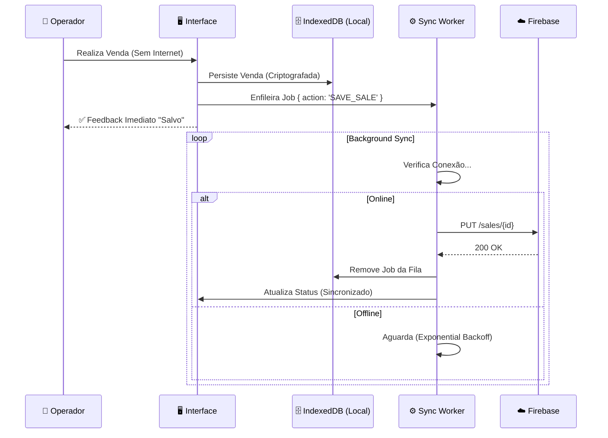

# 🍺 Botequista Pro - Sistema de Gestão para Bares (PWA)

<div align="center">


**[📘 Documentação Técnica Completa](DOCUMENTATION.md)**

</div>

---

## ⚡ Visão Geral

O **Botequista Pro** é uma solução **PWA (Progressive Web App)** de classe empresarial para gestão de bares e restaurantes. Projetado sob a filosofia **Offline-First**, ele garante que a operação de vendas (PDV) continue fluida e sem interrupções, independentemente da estabilidade da conexão de internet.

Diferente de sistemas web tradicionais, o Botequista trata a nuvem como um "estado eventual", priorizando a responsividade local e a segurança dos dados na ponta (Edge).

---

## 🏛️ Arquitetura Offline & Sync

O coração do sistema é uma **SyncQueue** (Fila de Sincronização) resiliente. O diagrama abaixo ilustra como garantimos que nenhuma venda seja perdida:



### Stack Tecnológica

| Camada | Tecnologia | Destaques |
| :--- | :--- | :--- |
| **Frontend** | React 19 | Hooks modernos, `useDeferredValue` para performance. |
| **Linguagem** | TypeScript | Tipagem estrita e interfaces compartilhadas. |
| **Persistência** | IndexedDB (`idb`) | Banco transacional no navegador. |
| **Backend** | Firebase RTDB | NoSQL em tempo real com regras de validação. |
| **API** | Vercel Serverless | Functions para buscas pesadas e relatórios. |
| **Design** | Tailwind CSS | Sistema de design tokenizado e Dark Mode nativo. |

---

## 📸 Interface do Sistema

> *O design prioriza contraste, legibilidade em ambientes noturnos e áreas de toque grandes para telas touch.*

| **Terminal de Vendas (PDV)** | **Relatórios Gerenciais** |
| :---: | :---: |
|  |  |
| *Fluxo rápido com botões de acesso imediato* | *Curva ABC e Fluxo de Caixa em tempo real* |

---

## 🚀 Funcionalidades Chave

### 1. Venda Expressa (Speed-Checkout)
Para bares com alto giro de balcão. O sistema gera automaticamente uma comanda temporária, bloqueia métodos de pagamento demorados (como "Pendura") e foca em fechar o pedido em menos de 3 cliques.

### 2. Tesouraria "Blind Close"
O fechamento de caixa é "cego". O operador insere a contagem física do dinheiro sem saber o valor esperado pelo sistema. O Botequista calcula automaticamente sobras ou quebras, prevenindo furtos e erros de contagem.

### 3. Gestão de Inventário & Curva ABC
Engenharia de cardápio integrada. Identifique automaticamente quais produtos são seus "Carro-Chefe" (Alta Venda / Alta Margem) e quais são "Abacaxis" (Baixa Venda / Baixa Margem).

---

## 🔧 Instalação e Desenvolvimento

```bash
# 1. Clone o repositório oficial
git clone https://github.com/botequista/sistema.git

# 2. Instale as dependências
npm install

# 3. Configure o ambiente
# Crie um arquivo .env na raiz com as chaves do Firebase
cp .env.example .env

# 4. Inicie o servidor local
npm run dev
```

## 📜 Licença

© 2024 Botequista Systems. Todos os direitos reservados.
Distribuído sob licença proprietária para uso comercial restrito.

---
*Developed with High-Performance React Standard.*
